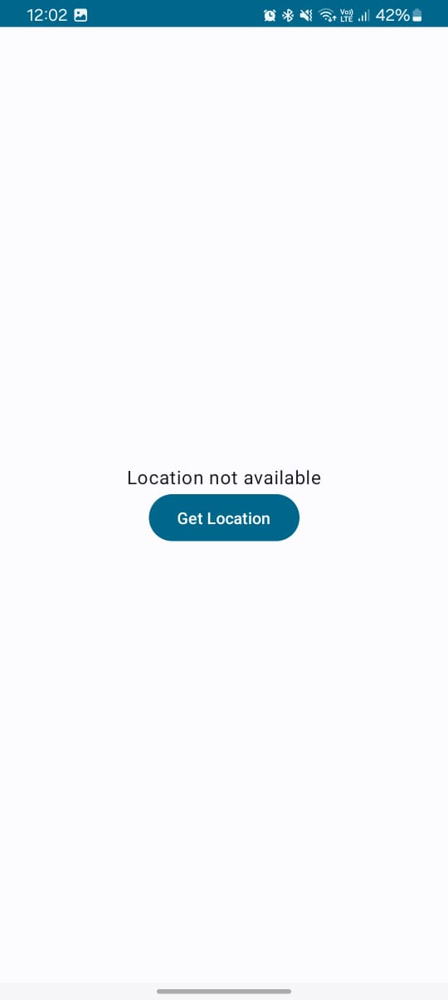
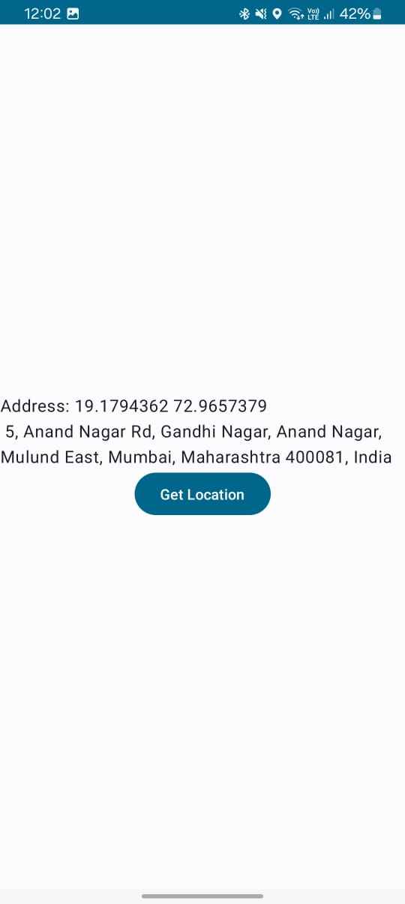

# 📍 My Location App

An Android application built using **Kotlin** and **Jetpack Compose** that fetches your **current location** and displays the full **address** (street, city, state, pin, etc) with just one tap.

---

## ✨ Features

- 📡 Get real-time current location
- 🗺️ Display human-readable address using Geocoder
- 🧭 One-tap button to fetch location
- ✅ Handles location permissions
- ⚡ Built with Jetpack Compose for a smooth UI

---


## 📱 Screenshots

| Feature      | Preview                                                    |
|--------------|------------------------------------------------------------|
| **Main Screen** |  |
| **Loaction** |     |


## 🛠️ Tech Stack

- Kotlin
- Jetpack Compose
- Fused Location Provider (Google Play Services)
- Geocoder
- Coroutines
- MVVM Architecture
- Material Design Components

---

## 🚀 Getting Started

### 1. Clone the Repository
```bash
git clone https://github.com/your-username/MyLocationApp.git
